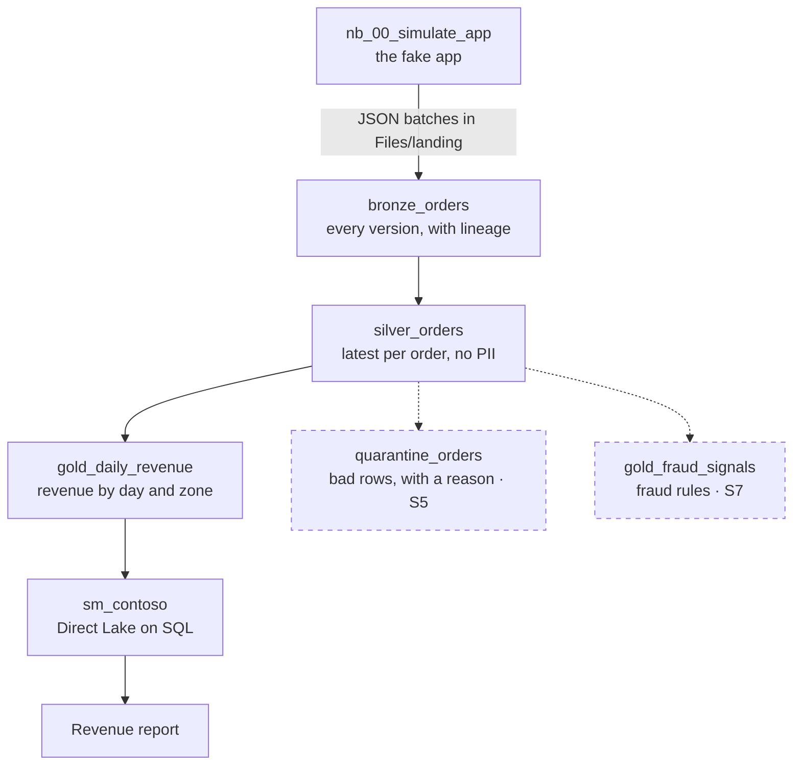
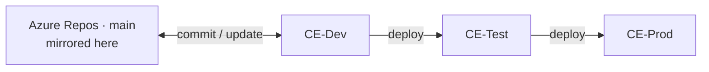

# Contoso Eats — orders analytics on Microsoft Fabric

An end-to-end analytics platform on Microsoft Fabric for a fictional food-delivery startup. A PySpark
simulator plays the startup's app and produces deliberately messy order data, a medallion lakehouse
turns it into revenue figures in Power BI, and every change is released **Dev → Test → Prod**.

**Stack:** Microsoft Fabric (Lakehouse, Notebooks, Data Pipelines, Direct Lake semantic model, Power
BI, deployment pipelines, Git integration) · PySpark · Spark SQL · Delta Lake · Azure DevOps (Repos,
Boards)

**Highlights**

- **Medallion architecture** (bronze, silver, gold) built from dirty data: re-sent and updated
  orders, late arrivals, refunds, and a column of personal data
- **Data quality enforced in the pipeline:** the latest version of each order via a window function,
  and checks that fail the run on duplicate orders or leaked personal data
- **CI/CD the Fabric way:** Git integration on Dev, a Dev → Test → Prod deployment pipeline, and data
  source rules so each stage's report reads its own data
- **Planned in Azure Boards** as epics, features and one user story per sprint

**Status:** v0.2 released to the Prod workspace, running on simulated data — 3 of 12 sprints done.
Next: incremental loads.

## Roadmap

- [x] **S0 Foundations** — Dev, Test and Prod workspaces on an F2, Git on Dev, a deployment pipeline, a backlog in Azure Boards
- [x] **S1 Walking skeleton** — raw JSON batches to a Direct Lake report, with retries, timeouts, a data dictionary and personal data dropped from day one
- [x] **S2 Correct numbers** — each order counted once: bronze keeps every version, silver keeps the latest, automated checks fail the run
- [ ] **S3 Incremental and safe to re-run** — process only new batches, MERGE into silver, move the watermark only after the commit *(next)*
- [ ] **S4 Configuration and access** — per-stage values from a variable library, a schedule only Prod acts on, Entra groups, Viewer-only Prod
- [ ] **S5 Quality gate and alerting** — quarantine bad rows with a reason, fail loudly past a per-stage limit, prove the alert arrives
- [ ] **S6 Privacy and compliance** — prove analysts can't read personal data, a tested erasure procedure, raw-file retention
- [ ] **S7 Fraud signals** — shared cards and velocity in 10-minute tumbling windows, refund abuse, a Risk page
- [ ] **S8 Performance and cost** — compaction, V-Order on gold, surge protection, measured before and after
- [ ] **S9 Operability and recovery** — a freshness alarm, restore and backfill drills, a runbook
- [ ] **S10 Spike: live orders** — Eventstream into an Eventhouse, a KQL dashboard and an Activator rule, kept in Dev
- [ ] **S11 Change it safely as a team** — a protected `main`, pull requests, branched-out feature workspaces

Must: S0–S4 · Should: S5–S7 · Could: S8, S9, S11 · Spike: S10

## How the data flows

`pl_orders` runs simulate → bronze → silver → gold → checks. Every activity retries twice, three
minutes apart, and times out after an hour. Bronze and silver write their row counts to
`ops_run_log` with the pipeline's run ID. Dashed boxes are planned.

## How changes ship

- Only Dev is connected to Git. Test and Prod are fed by the deployment pipeline, and nothing is
  created or edited in them directly.
- Deployment carries definitions, never data. Each stage's simulator makes its own data, so Dev and
  Test never hold Prod data.
- A Direct Lake model doesn't rebind when it's deployed. `sm_contoso` is Direct Lake **on SQL** —
  the only flavour a deployment rule can repoint — so each stage's report reads its own stage.
- Work is tracked in Azure Boards: epics for outcomes, features for capabilities, one user story
  per sprint. Release commits reference the stories they close.

## Production readiness, now and next

Every concern exists from the first release in its smallest honest form, then gets tuned up.

| Concern | In place now | Planned |
|---|---|---|
| Security & access | Only the engineer, in every workspace; nothing shared | S4 Entra groups, Viewer-only Prod · S6 analysts denied bronze and silver |
| Privacy | `customer_email` never leaves bronze, and a check fails the run if it does | S6 tested erasure, raw-file retention, endorsement |
| Data quality | Explicit schema; safe casts turn bad values into nulls; a duplicate-order check | S5 quarantine and a per-stage gate · S7 detection tests |
| Reliability | Retries and a timeout on every activity | S3 idempotent incremental loads · S9 restore and backfill drills |
| Observability | Row counts per step in `ops_run_log`; Monitoring hub | S5 a proven alert path · S9 a freshness alarm |
| Cost | An F2 capacity, paused when idle; Spark sized to one executor | S3 less compute per run · S8 surge protection |
| Performance | Runtime 2.0 with the native execution engine | S8 compaction, V-Order on gold |
| Change management | Git on Dev; Dev → Test → Prod; a pinned Spark runtime | S4 per-stage configuration · S11 pull requests |
| Documentation | `nb_README`: a data dictionary and known limitations | A release note per sprint · S9 runbook |

## Design decisions

- **Latest version per order, not `dropDuplicates`.** The app re-sends and updates orders. Silver
  numbers each order's rows newest first and keeps row one; `dropDuplicates` keeps an arbitrary copy.
- **Safe casts.** Runtime 2.0 runs Spark 4 in ANSI mode, where a plain cast throws on bad input.
  `try_cast` and `try_to_timestamp` turn it into a null instead.
- **Checks inside the pipeline.** `nb_90_checks` raises an error, so a duplicate order or a leaked
  email column turns the run red instead of reaching the report.
- **A run log as well as the Monitoring hub.** The hub says a run succeeded; `ops_run_log` says how
  many rows it moved. A success with zero rows is the failure nobody gets alerted about.
- **One pinned environment.** The `Contoso` environment fixes the Spark runtime for every notebook,
  so Dev, Test and Prod can't drift apart.

## Known limitations

- Every run reprocesses every file — S3
- Settings are the same in every stage — S4
- The schedule is part of the pipeline's definition, so it deploys to every stage — S4
- Bad values become nulls but aren't stopped — S5
- The revenue report isn't in source control yet

## What's in this repository

Each folder is a Fabric item, written by Fabric's Git integration.

| Item | Type | Role |
|---|---|---|
| `nb_00_simulate_app` | Notebook | The fake app: writes one messy JSON batch per run |
| `nb_05_bronze` | Notebook | Reads landing files with an explicit schema and adds lineage columns |
| `nb_10_silver` | Notebook | Keeps the latest version of each order, drops the email, casts safely |
| `nb_20_gold` | Notebook | Delivered revenue by day and zone |
| `nb_90_checks` | Notebook | Fails the run if an invariant breaks |
| `nb_README` | Notebook | The data dictionary and known limitations, inside the workspace |
| `pl_orders` | Data pipeline | Runs the notebooks in order, with retries, timeouts and a schedule |
| `lh_contoso` | Lakehouse | Landing files and Delta tables |
| `sm_contoso` | Semantic model | Direct Lake on SQL over the gold table |
| `Contoso` | Environment | Spark Runtime 2.0 with the native execution engine, sized for an F2 |

## Run it yourself

1. You need a Fabric capacity — an F2 is enough — and, below F64, a Power BI Pro, PPU or trial
   licence to build and view the report.
2. Fork this repository. In a new workspace, open **Workspace settings → Git integration → GitHub**
   and connect to your fork's `main`. A tenant admin has to allow *Users can synchronize workspace
   items with GitHub repositories* first.
3. Open each notebook and attach `lh_contoso` as its default lakehouse. The committed metadata still
   holds the original lakehouse's ID; the `Contoso` environment rebinds by itself.
4. Run `pl_orders`, then query `gold_daily_revenue` from the lakehouse's SQL analytics endpoint.
5. `sm_contoso` still points at the original SQL endpoint. Create your own from your endpoint:
   **Reporting → New semantic model → Direct Lake on SQL**.
